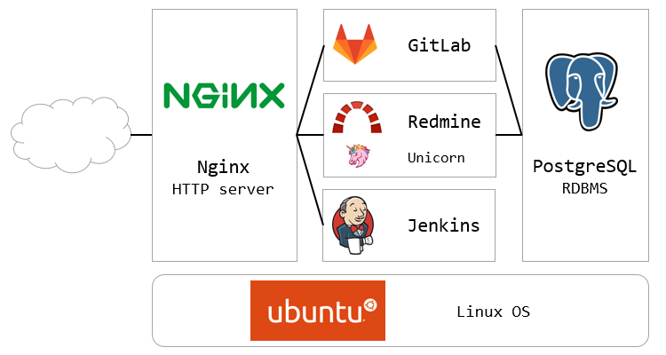

# 開発環境サーバ

## 概要
Ansibleを使用して開発環境サーバを構築します。  
下記のWebアプリケーションが利用できるようになります。
- Redmine
- GitLab
- Jenkins



## 対象環境
- Ubuntu 14.04
- Ubuntu 16.04 (Python2.xを別途インストールする必要があります)

## URL
| Web application | URL                           |
|:----------------|:------------------------------|
| Redmine         | http:// &lt;FQDN&gt; /        |
| GitLab          | http:// &lt;FQDN&gt; /gitlab  |
| Jenkins         | http:// &lt;FQDN&gt; /jenkins |

## 使い方
必須の設定項目を埋めてから実行してください。

### 1. 設定項目
#### 必須
| ファイル       | 説明                                         |
|:---------------|:---------------------------------------------|
| hosts          | インストールするサーバのIPアドレスの設定です |
| group_vars/all | 環境全体に関わる設定です                     |
※ 設定しなければならない箇所は &lt; &gt; で囲っています

#### 任意
| ファイル              | 説明                                                                |
|:----------------------|:--------------------------------------------------------------------|
| web-servers.yml       | Redmine/GitLabのバックアップ設定を有効にできます（デフォルトはOFF） |
| nginx/vars/main.yml   | 各WebアプリケーションのURLを変更できます                            |
| redmine/vars/main.yml | Redmineのインストール場所とバージョンを変更できます                 |
| ruby/vars/main.yml    | Rubyのバージョンを変更できます（Redmineと関係しています）           |
| java/vars/main.yml    | Javaのバージョンを変更できます（Jenkinsと関係しています）           |

### 2. 実行
```
./setup.sh
```

## オプション
下記のRoleはデフォルトでは有効になっていません。  
使用したい場合はvarsの必須項目を設定して実行するRoleに加えてください。

| Role           | 説明                                                        |
|:---------------|:------------------------------------------------------------|
| redmine_backup | 任意のディレクトリにRedmineのデータをバックアップします     |
| gitlab_backup  | 任意のディレクトリにGitLabのデータをバックアップします      |
| mount_cifs     | CIFSを使用してマウントします                                |
| dns            | DNSサーバをインストールしドメインとホスト名を設定します     |
